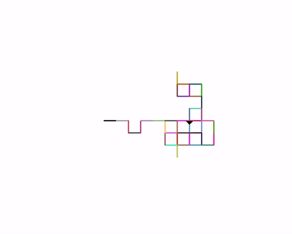
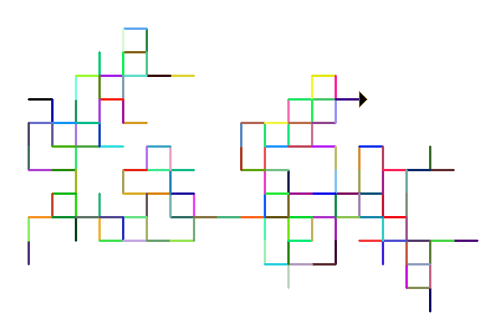

# Random-walk-with-python-turtle-graphics.
Modelling of random motions which can be used for studying particle's irregular motion.
The importance and applications of random motion can be found here: https://en.wikipedia.org/wiki/Random_walk.

The outcome of this random walk for 300 steps is shown below

